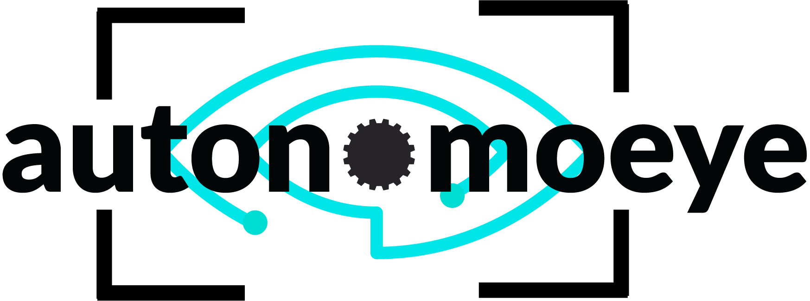

<!-- PROJECT LOGO -->
 

  

  <h3 align="center">Autonomoeye</h3>

  

    SIADS 699 Capstone Project
     
  

<!-- TABLE OF CONTENTS -->

  
Table of Contents

  <ol>
    <li>
      <a href="#project-overview">Project Overview</a>
    </li>
    <li>
      <a href="#waymo-dataset">Waymo Dataset</a>
      <ul>
        <li><a href="#images">Images</a></li>
        <li><a href="#annotations">Annotations</a></li>
        <li><a href="#metadata">Metadata</a></li>
      </ul>
    </li>
    <li>
      <a href="#architecture">Architecture</a>
      <ul>
        <li><a href="#system_view">System View</a></li>
        <li><a href="#technology_view">Technology View</a></li>
      </ul>
    </li>
    <li><a href="#data_processing">Data Processing</a></li>
    <li><a href="#faster_r_cnn_model">Faster R CNN Model</a></li>
    <li><a href="#model_training">Model Training</a></li>
    <li><a href="#model_evaluation">Model Evaluation</a></li>
    <li><a href="#user_interface">User Interface</a></li>
    <li><a href="#results">Results</a></li>
  </ol>

 
 
 

## Project Overview

The goal of this project is to develop an object detection model using the Waymo Open Dataset and create an interactive user interface (UI) using Streamlit and Flask. The UI will allow users to upload images, visualize the object detection results, and adjust the model's parameters in real time.

## Waymo Dataset

Waymo Open Dataset is the largest and most diverse multimodal autonomous driving dataset to date, comprising of images recorded by multiple high-resolution cameras and sensor readings from LiDAR scanners. The data has been recorded with large geographical coverage within multiple cities like San Francisco, Phoenix and many more.

Since our project focuses on 2D detection, the only data we are using are the camera images. The dataset contains around 10 million camera box annotations, all manually annotated for 1150 scenes or segments. 

[![waymo][waymo-screenshot]](https://waymo.com/open/)

### Images

We have five different views for a given frame/scene in the segments

- FRONT
- FRONT_LEFT
- FRONT_RIGHT
- SIDE_LEFT
- SIDE_RIGHT

### Annotations

Each object (vehicles, pedestrians, cyclists and signs) are annotated with a tightly fitting 4-DOF image axis-aligned 2D bounding box. The label is encoded as (cx, cy, l, w) with a unique tracking ID, where cx and cy represent the center pixel of the box, l represents the length of the box along the horizontal (x) axis in the image frame, and w represents the width of the box along the vertical (y) axis in the image frame.

### Metadata

We also have metadata related to the scene and image capture. 

- Segment Name
- Date
- Time of the day
- Location
- Weather

## Architecture

We have strcutured our architecture components of the project in modules so that the components can be reused and modified. This section provides details on our system view and technology view.

### System View
Below is our logical system architecture with all the components used to develop the solution.

![system][system-screenshot]

### Technology View

Here are the major frameworks/libraries used in our project.

![tech][tech-screenshot]

## Data Processing

## Faster R CNN Model

For object detection we need to build a model and teach it to learn to both recognize and localize objects in the image. The Faster R-CNN model takes the following approach: The Image first passes through the backbone network to get an output feature map, and the ground truth bounding boxes of the image get projected onto the feature map. The backbone network is usually a dense convolutional network like ResNet or MobileNet. The output feature map is a spatially dense Tensor that represents the learned features of the image. Next, we treat each point on this feature map as an anchor. For each anchor, we generate multiple boxes of different sizes and shapes. The purpose of these anchor boxes is to capture objects in the image.

We use a 1x1 convolutional network to predict the category and the offsets of all the anchor boxes. During training, we sample the anchor boxes that overlap the most with the projected ground truth boxes. These are called positive or activated anchor boxes. We also sample negative anchor boxes which have little to no overlap with the ground truth boxes. The positive anchor boxes are assigned the category object, while the negative boxes are assigned background. The network learns to classify anchor boxes using binary cross-entropy loss. Now, the positive anchor boxes may not exactly align with the projected ground truth boxes. So we train a similar 1x1 convolutional network to learn to predict offsets from ground truth boxes. These offsets when applied to the anchor boxes bring them closer to the ground truth boxes. We use L2 regression loss to learn the offsets. The anchor boxes are transformed using the predicted offsets and are called region proposals, and the network described above is called the region proposal network.

We learn to predict the category of the object in the region proposal using a simple convolutional network. The raw region proposals are of different sizes, so we use a technique called ROI pooling to resize them before passing through the network. This network learns to predict multiple categories using cross-entropy loss. We use another network to predict offsets of region proposals from ground truth boxes. This network further tries to align region proposals with ground truth boxes. This uses L2 regression loss. Finally we take a weighed combination of both the losses to compute the final loss.

![frcnn][frcnn-screenshot]

## Model Training

## Model Evaluation

## User Interface

## Results

[waymo-screenshot]: images/waymo.png
[system-screenshot]: images/system_view.png
[tech-screenshot]: images/tech_view.png
[frcnn-screenshot]: images/fastrcnn.png

